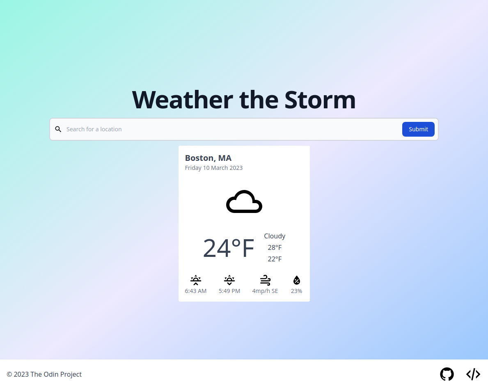

 

  

  <h3 align="center">Weather the Storm</h3>

  

    A Reponsive Front-end Weather Application Built on the OpenWeatherMap API
     
     
    <a href="https://github.com/trustpizza/weather-app/issues">Report Bug</a>
    .
    <a href="https://github.com/trustpizza/weather-app/issues">Request Feature</a>
  

## Table Of Contents

* [About the Project](#about-the-project)
* [Built With](#built-with)
* [License](#license)
* [Authors](#authors)
* [Acknowledgements](#acknowledgements)

## About The Project

This project is an exercise in creating a **high-quality, responsive front-end experience**, in **dynamically displaying data**,   and implementing **API calls via Javascript Promises and asynchronous functions**.   This project was created in conjunction with [The Odin Project](https://www.theodinproject.com), an Open Source full stack web development community and course.  The weather information fro this project comes from [Open Weather Map](https://openweathermap.org/), a weather company offering a free tier of their weather data API.

While I would be honored if you used this as your daily weather app, the data given via the free tier is both sparse and limited in the number of API calls one can make in a given day/hour/minute.  Please leave any feedback to me :)

## Built With

This is project is built using the following technologies:
+ Javascript
+ HTML
+ Tailwind CSS

### Creating A Pull Request

## License

Distributed under the MIT License. See [LICENSE](https://github.com/trustpizza/weather-app/blob/main/LICENSE.md) for more information.

## Authors

* **Axel Olsson** - *Full Stack Web Developer* - [Axel Olsson](https://github.com/trustpizza/) - *Created Weather App*

## Acknowledgements

* [The Odin Project](https://github.com/TheOdinProject)
